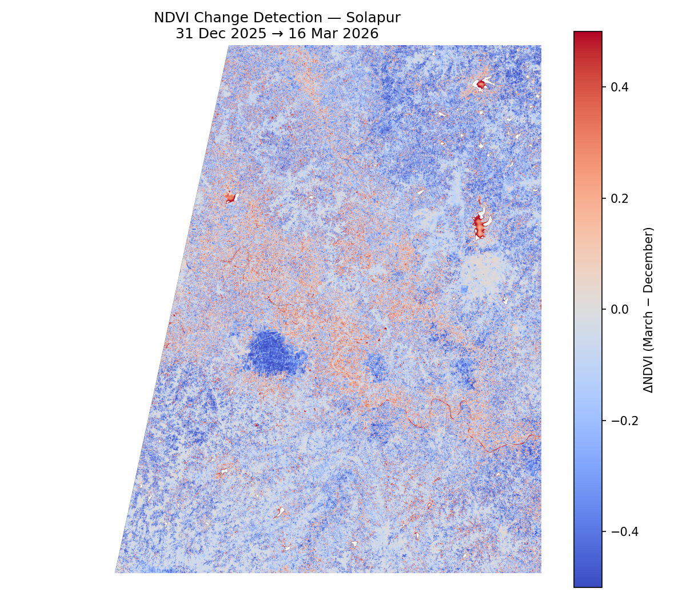
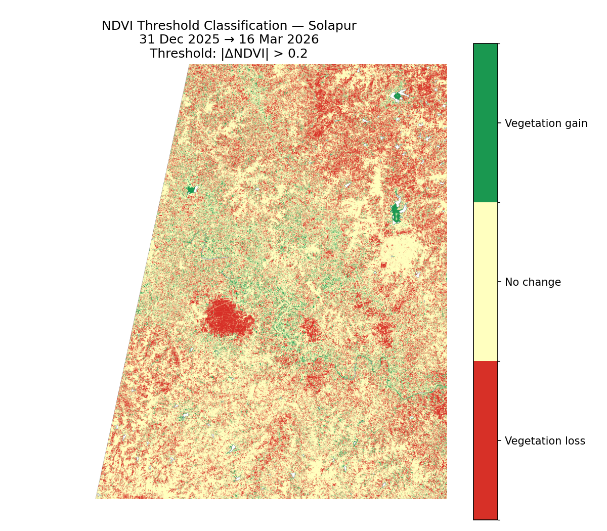
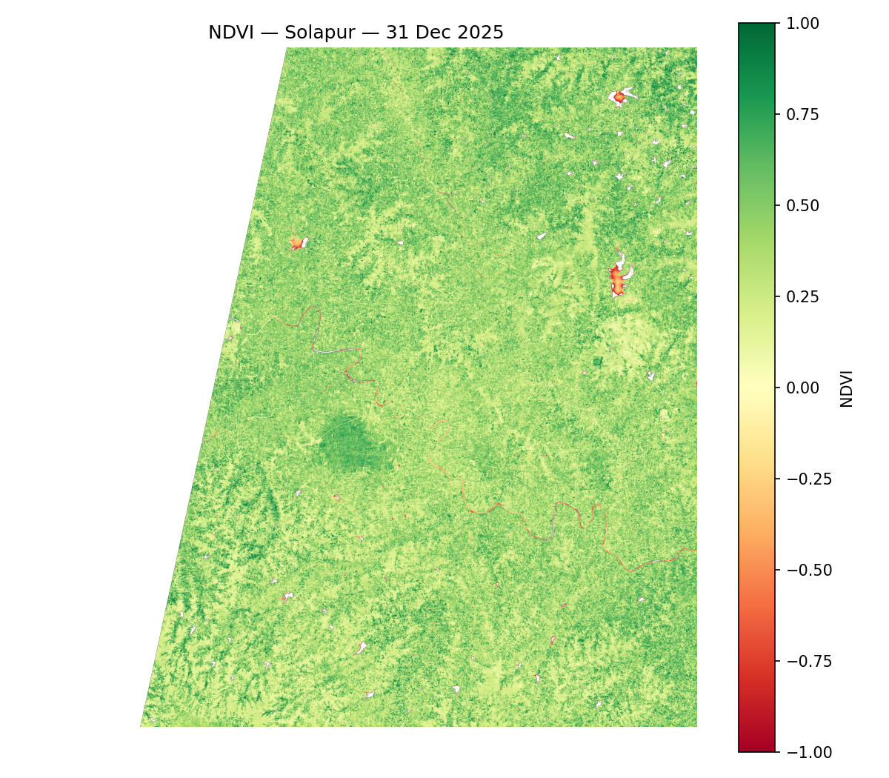
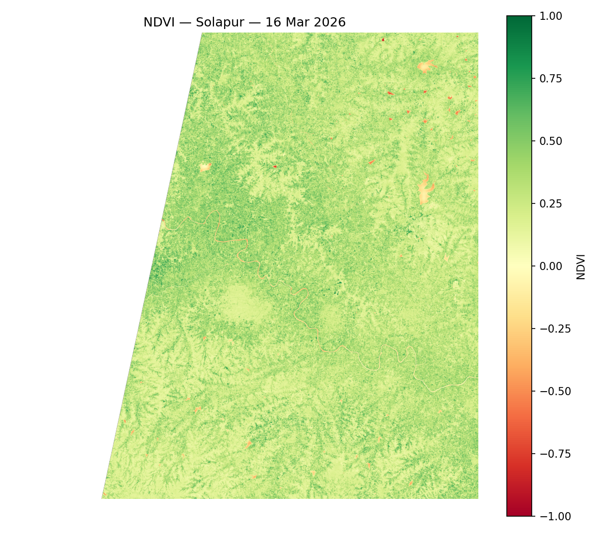
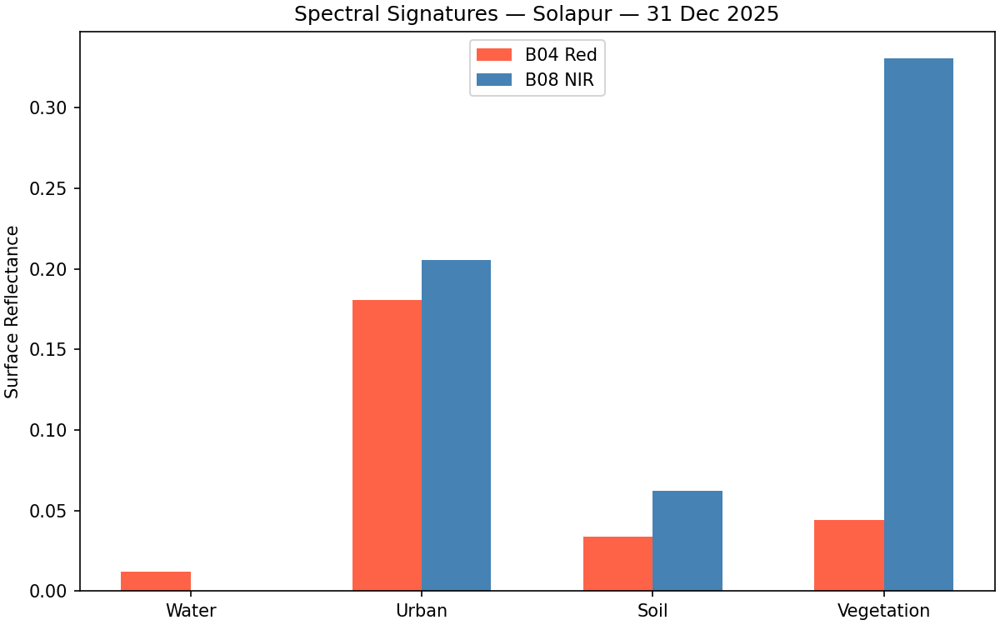
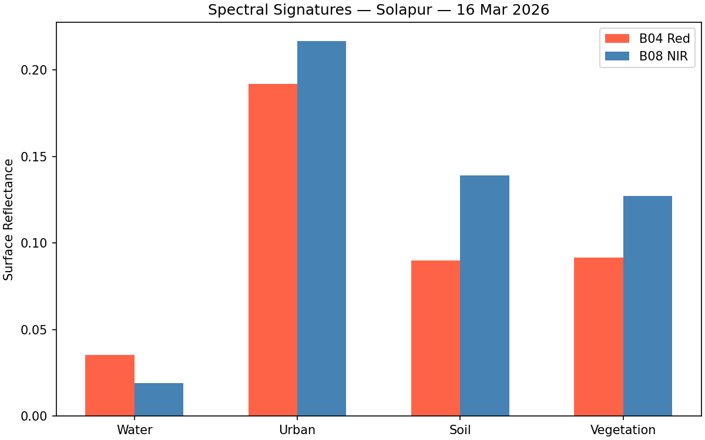
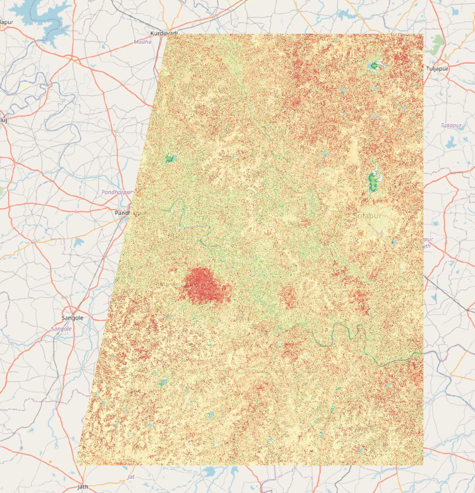

# Solapur NDVI Change Detection — Sentinel-2 L2A

**Tile:** T43QEV (Solapur District, Maharashtra)  
**Dates:** 31 Dec 2025 vs 16 Mar 2026  
**Sensor:** Sentinel-2C / Sentinel-2B, MSI, 10m resolution

Detects seasonal vegetation change over Solapur using NDVI computed from Sentinel-2 L2A Bottom-of-Atmosphere reflectance. The December acquisition captures peak Rabi crop growth; the March acquisition captures post-harvest decline — consistent with the Rabi cycle phenology for this region.

---

## Results

### NDVI Change Detection (ΔNDVI = March − December)
Blue = NDVI decrease (vegetation loss). Red = NDVI increase (vegetation gain).



### Threshold Classification
ΔNDVI < −0.2 → vegetation loss (red). ΔNDVI > +0.2 → vegetation gain (green). Remainder → no significant change.



### NDVI Maps

| 31 Dec 2025 | 16 Mar 2026 |
|:-----------:|:-----------:|
|  |  |

### Spectral Signatures
B04 (Red) and B08 (NIR) reflectance sampled at four georeferenced land cover classes.

| 31 Dec 2025 | 16 Mar 2026 |
|:-----------:|:-----------:|
|  |  |

### QGIS Validation — NDVI Change over Solapur District


---

## Methodology

1. **Data:** Sentinel-2 L2A MSI, tile T43QEV, bands B04 (Red, 665 nm) and B08 (NIR, 842 nm), 10m spatial resolution. Downloaded from [Copernicus Data Space](https://dataspace.copernicus.eu/).

2. **BOA correction:** Raw DN values converted to surface reflectance: `ρ = (DN − 1000) / 10000`. Pixels outside [−0.1, 1.0] masked as NaN (clouds, saturated pixels, fill values).

3. **NDVI:** `NDVI = (B08 − B04) / (B08 + B04)`. Division-by-zero and out-of-range results set to NaN.

4. **Spatial alignment:** Raster shapes and affine transforms verified to match before pixel-wise subtraction.

5. **Change detection:** `ΔNDVI = NDVI_March − NDVI_Dec`. Threshold classification at ±0.2.

6. **Cross-validation:** Results visually verified in QGIS against the raw tile imagery.

---

## Key Finding

NDVI decreased significantly from December to March across agricultural areas — consistent with Rabi crop harvesting. The large patch of vegetation loss (row ~6000 in the tile) aligns with the dense December cropland area visible in both the NDVI map and QGIS. Scattered gain patches are likely irrigated plots or early Zaid crop emergence.

---

## How to Run

### Requirements
```
pip install rasterio numpy matplotlib
```

### Setup
1. Download Sentinel-2 L2A data for tile **T43QEV** from https://dataspace.copernicus.eu/
   - Scene 1: `S2C_MSIL2A_20251231*`
   - Scene 2: `S2B_MSIL2A_20260316*`

2. Open `sentinel2_pipeline.py` and update the two paths at the top of the CONFIG section:
```python
SAFE_DEC   = r"path/to/S2C_MSIL2A_20251231...SAFE"
SAFE_MARCH = r"path/to/S2B_MSIL2A_20260316...SAFE"
```

3. Run:
```bash
python sentinel2_pipeline.py
```

All 10 output images will be saved to `./outputs/`.

---

## Repository Structure

```
├── sentinel2_pipeline.py     # Full analysis pipeline (single script)
├── requirements.txt
├── outputs/
│   ├── ndvi_dec2025.png
│   ├── ndvi_march2026.png
│   ├── histogram_31dec2025.png
│   ├── histogram_16march2026.png
│   ├── ndvi_histogram_31dec2025.png
│   ├── ndvi_histogram_16march2026.png
│   ├── spectral_signatures_31dec2025.png
│   ├── spectral_signatures_16march2026.png
│   ├── ndvi_change_detection.png
│   └── ndvi_threshold_classified.png
└── README.md
```

---

## Sample Point Coordinates (UTM Zone 43N)

| Land Cover | Easting | Northing |
|---|---|---|
| Water | 596315 | 1959919 |
| Urban | 597336 | 1952676 |
| Soil | 591941 | 1969797 |
| Vegetation | 552839 | 1938202 |